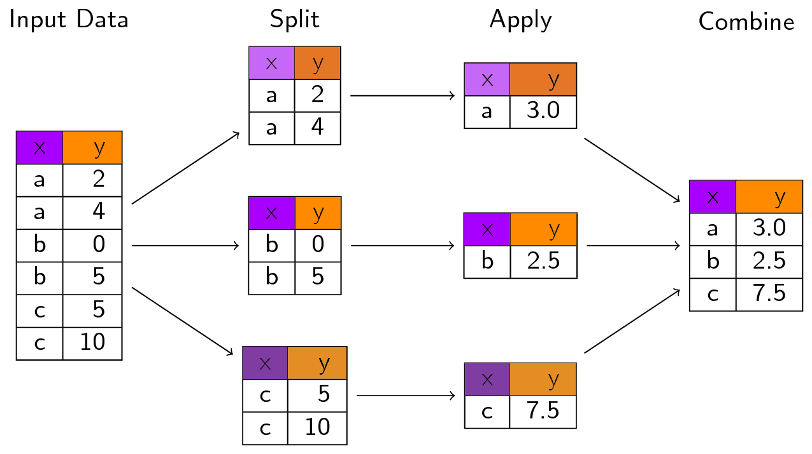
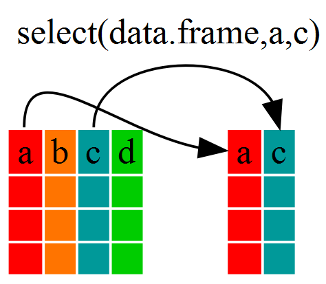
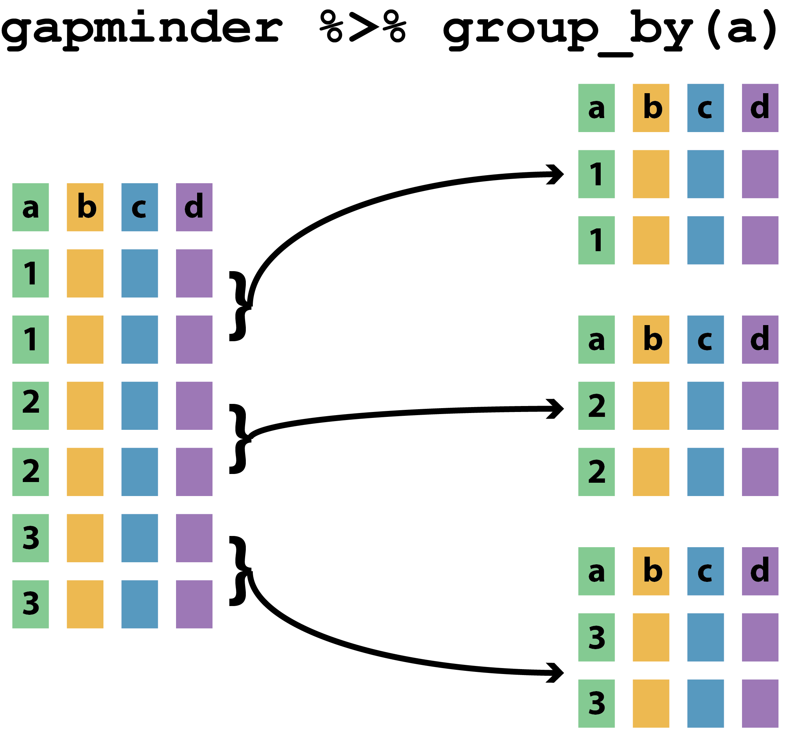
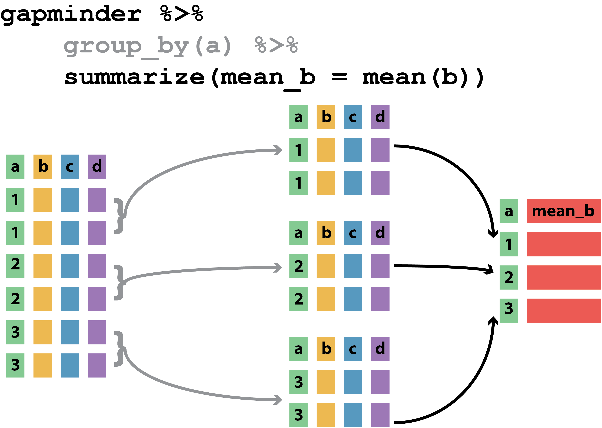
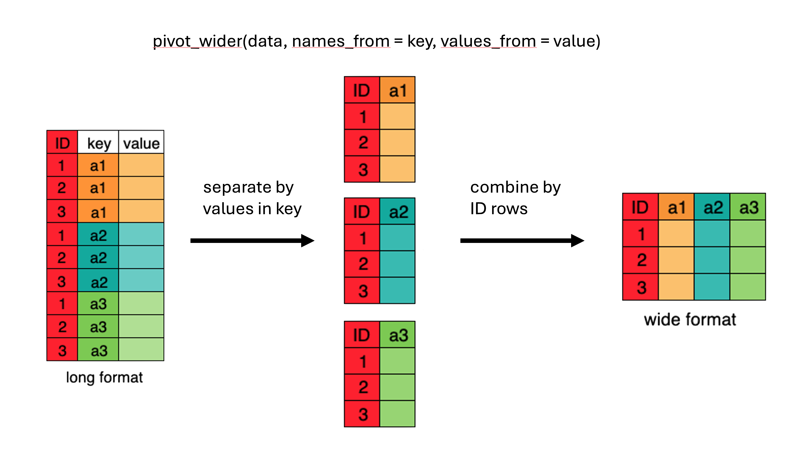

```{r}
#| label: setup

library(kableExtra)
library(tidyverse)
```

## Learning Questions

- How can I read data in `R`?
- What are the basic data types in `R`?
- How do I represent categorical information in `R`?

## Learning Objectives

- To be able to identify the five (5) main data types in `R`
- To explore data frames (and see how they are built from `R` data types)
- To be able to ask `R` about the type and structure of an object

## Data Types and Structures in `R` {.scrollable}

- `R` is mostly used for data analysis
- `R` has special *types* and *structures* to help you work with data
- Much of the focus in `R` is on tabular data (*data frames*) 

::: { .callout-important }
## Interactive Demo

- toy dataset <br />
- `feline-data.csv`
:::

::: { .callout-tip }
**Understanding data types, their uses, and how they relate to your own data is key to successful analysis with `R`**
:::

# 1. Data Types

## What Data Types Do You Expect?

::: { .callout-warning }
## What data types would you expect to see?

What examples of data types can you think of from your own experience?
:::

::: { .callout-note }
## Please write in the chat

Add your suggestions of data types at:

[https://pad.carpentries.org/2025-06-16-strathclyde](https://pad.carpentries.org/2025-06-16-strathclyde)
:::

## Data Types in `R`

::: { .callout-caution }
## Data *types* in `R` are *atomic*

1. **logical**: `TRUE`, `FALSE`
2. **numeric**:
    * **integer**: `3`, `2L`, `123456`
    * **double** (*decimal*): `3.0`, `-23.45`, `pi`
3. **character** (*text*): `"a"`, `'SWC'`, `"This is not a string"`

(also `complex` and `raw`)
:::

::: { .callout-important }
## INTERACTIVE DEMO
:::

## A Quick Note About Dataframes

::: { .callout-tip }
## Columns in dataframes

- A column in a dataframe can contain only one data type
:::

- Adding a character string (`2.3 or 2.4`) to the column of `double`s changed its data type from `double` to `character`.

::: { .callout-note }
## Coercion: a preview

- We can always represent a number (e.g. `2.1`) as a string (e.g. `"2.1"`)
- We can't always represent a string (e.g. `"or"`) as a number
:::

::: { .callout-important }
## INTERACTIVE DEMO
:::

# 2. Data Structures

## Vectors

- Vectors are the most common data structure in `R`
- An _ordered collection_ of data
- Can contain only a single datatype

::: { .callout-important }
## INTERACTIVE DEMO

- Understanding vectors
:::

## Coercion

::: { .callout-important }
## INTERACTIVE DEMO
:::

. . .

::: { .callout-caution }
## Type coercion

- We need to be aware of datatypes and how `R` interprets them
- Otherwise we can meet some surprises
:::

::: { .callout-important }
## INTERACTIVE DEMO

- Vector coercion
:::

## Coercion

- `R` will coerce vectors *implicitly* to make them atomic

::: { .callout-tip }
## Coercion hierarchy

`logical` $\rightarrow$ `integer` $\rightarrow$ `double` $\rightarrow$ `complex` $\rightarrow$ `character`

- can coerce manually with `as.<type_name>()`
:::

::: { .callout-warning}
## Check your inputs

**If there are formatting problems with your data, you might not have the type you expect when you import into `R`**
:::

::: { .callout-important }
## INTERACTIVE DEMO
:::

## Lists

- `list`s are like *vectors*, but can hold *any combination of datatype*

::: { .callout-important }
## INTERACTIVE DEMO
:::

::: { .callout-tip }
## Working with list data

*elements* in a `list` are denoted by `[[]]` and individual elements can also be named
:::

# 3. Data Frames

## Let's Look At A Data Frame

- The `cats` data is a `data.frame`

::: { .callout-important }
## INTERACTIVE DEMO
:::

. . . 

::: { .callout-note }
## What is a data frame?

**A data frame is a special _named list_ of _vectors_ with the same length**

- It's _like_ a spreadsheet, but each column must have a given type, and all columns must be the same length.
:::

## Load Episode Data

::: { .callout-important }
## INTERACTIVE DEMO
:::

::: { .callout-caution }
## Where to find the data

- [https://raw.githubusercontent.com/swcarpentry/r-novice-gapminder/main/episodes/data/gapminder_data.csv](https://raw.githubusercontent.com/swcarpentry/r-novice-gapminder/main/episodes/data/gapminder_data.csv)
- Link available on the Etherpad ([https://pad.carpentries.org/2025-06-16-strathclyde](https://pad.carpentries.org/2025-06-16-strathclyde))
:::

::: { .callout-tip }
## Where to save the data

Save the data to the `data` subfolder (where you put `feline-data.csv`)
:::

## Investigating `gapminder`

::: { .callout-important }
## INTERACTIVE DEMO
:::

```{.r}
str(gapminder)              # structure of the data.frame
typeof(gapminder$year)      # data type of a column
length(gapminder)           # length of the data.frame
nrow(gapminder)             # number of rows in data.frame
ncol(gapminder)             # number of columns in data.frame
dim(gapminder)              # number of rows and columns in data.frame
colnames(gapminder)         # column names from data.frame
head(gapminder)             # first few rows of dataframe
summary(gapminder)          # summary of data in data.frame columns
```

# 4. Data Frame Manipulation With `dplyr`

## Learning Objectives

- How to manipulate `data.frame`s with the six *verbs* of `dplyr`
  - a 'grammar of data manipulation'

::: { .callout-note }
- `select()`
- `filter()`
- `group_by()`
- `summarize()`
- `mutate()`
- `%>%` (pipe)
:::

## What and Why is `dplyr`?

- `dplyr` is another package in the *Tidyverse*
- Facilitates analysis by *groups* in Tidy Data
  - Helps avoid repetition
    
::: { .callout-tip }
Avoiding repetition (though automation) makes code

* **robust**
* **reproducible**
:::

## Split-Apply-Combine



## `select()`

{fig-align="center"}

::: { .callout-important }
## INTERACTIVE DEMO
:::

## `filter()`

::: { .callout-tip }
## `filter()` selects rows on the basis of some condition
:::

::: { .callout-important }
## INTERACTIVE DEMO
:::

```{.r}
filter(gapminder, continent=="Europe")

# Select gdpPercap by country and year, only for Europe
eurodata <- gapminder %>%
              filter(continent == "Europe") %>%
              select(year, country, gdpPercap)
```

## Challenge (5min)

::: { .callout-caution }
## Challenge

Can you write a single line (which may span multiple lines in your script by including pipes) to produce a dataframe from `gapminder` containing:

- life expectancy, country, and year data
- only for African nations

- How many rows does the dataframe have?
:::

## `group_by()`

::: { .callout-important }
## INTERACTIVE DEMO
:::

{fig-align="center"}


```{.r}
group_by(gapminder, continent)
gapminder %>% group_by(continent)
```

## `summarize()`

::: { .callout-important }
## INTERACTIVE DEMO
:::

{fig-align="center"}

```{.r}
# Produce table of mean GDP by continent
gapminder %>%
    group_by(continent) %>%
    summarize(meangdpPercap=mean(gdpPercap))

```

## Challenge (5min)

::: { .callout-caution }
## Challenge

- Can you calculate the average life expectancy per *country* in the `gapminder` data?
- Which nation has longest life expectancy, and which the shortest?
:::

## `count()` and `n()`

::: { .callout-tip }
## Two useful functions related to `summarize()`

- `count()`/`tally()`: a function that reports a table of counts by group
- `n()`: a function used *within* `summarize()`, `filter()` or `mutate()` to represent count by group
:::

::: { .callout-important }
## INTERACTIVE DEMO
:::

```{.r}
gapminder %>%
  filter(year == 2002) %>%
  count(continent, sort = TRUE)

gapminder %>%
  group_by(continent) %>%
  summarize(se_lifeExp = sd(lifeExp)/sqrt(n()))
```

## `mutate()`

::: { .callout-tip }
`mutate()` is a function allowing creation of new variables
:::

::: { .callout-important }
## INTERACTIVE DEMO
:::

```{.r}
# Calculate GDP in $billion
gdp_bill <- gapminder %>%
  mutate(gdp_billion = gdpPercap * pop / 10^9)

# Calculate total/sd of GDP by continent and year
gdp_bycontinents_byyear <- gapminder %>%
    mutate(gdp_billion=gdpPercap*pop/10^9) %>%
    group_by(continent,year) %>%
    summarize(mean_gdpPercap=mean(gdpPercap),
              sd_gdpPercap=sd(gdpPercap),
              mean_gdp_billion=mean(gdp_billion),
              sd_gdp_billion=sd(gdp_billion))
```

## `ifelse()`

::: { .callout-tip }
`ifelse()` allows us to restrict apply filtering when we use `mutate()`

- `ifelse([CONDITION], [VALUE IF TRUE], [VALUE IF FALSE]`)
:::

::: { .callout-important }
## INTERACTIVE DEMO
:::

```{.r}
gdp_billion_large_countries <- gapminder %>%
  mutate(gdp_billion_large = ifelse(pop > 10e6, 
                                    gdpPercap * pop / 10^9,
                                    NA))
```

# 5. Tidy Data

## Why Tidy Data?

> "Tidy datasets are all alike, but every messy dataset is messy in its own way"

::: { .callout-caution }
## Data Cleaning is not just a first step

- Cleaning is needed whenever new data turns up, new ideas arrive, etc.
- About 80% of the effort of data analysis is cleaning and preparing data

**Principles of _Tidy Data_ provide a standard way to organise data values within a dataset**
:::

## An Untidy Dataset (1)

::: { .callout-warning }
## What's wrong with this data?
:::

```{r}
df1 <- data.frame(treatment=c("treatment.A", "treatment.B"),
                  John.Smith=c(NA, 2),
                  Jane.Doe=c(16, 11),
                  Mary.Johnson=c(3, 1))
colnames(df1) = c("", "John Smith", "Jane Doe", "Mary Johnson")
```

```{r, echo=FALSE}
kable(df1)
```

## An Untidy Dataset (2)

::: { .callout-warning }
## Is this better?
:::

```{r}
df2 <- data.frame(name=c("John Smith", "Jane Doe", "Mary Johnson"),
                 treatment.A=c(NA, 16, 3),
                 treatment.B=c(2, 11, 1))
colnames(df2) = c("", "treatment.A", "treatment.B")
```

```{r, echo=FALSE}
kable(df2)
```

. . .

::: { .callout-caution }
## We need to talk about data semantics
:::

## Data Semantics

::: { .callout-tip }
## A dataset is a collection of **VALUES**
:::

```{r, echo=FALSE}
kable(df1)
```

::: { .callout-note }
## Each **value** belongs to a **variable** and an **observation**

- **VARIABLES** (can *change* or *vary*): values that are *measured* or *decided* by a researcher: height, temperature, duration, treatment, etc.
- **OBSERVATIONS**: values measured across all variables for the same individual/unit/group: person, reactor, religion, company, etc.
:::

## Challenge (2min)

::: { .callout-warning }
## In the table below, what are the rows and columns?
:::

```{r, echo=FALSE}
kable(df1)
```

::: { .callout-note }
- Rows=OBERVATIONS, Columns=VARIABLES
- Rows=OBERVATIONS, Columns=NEITHER
- Rows=NEITHER, Columns=VARIABLES
- Rows=NEITHER, Columns=NEITHER

**USE CHALLENGE SECTION ON ETHERPAD**
:::

## A Tidy Dataset (1)

::: { .callout-caution }
## The dataset contains 18 values

There are three variables and six observations
:::

::: { .callout-note }
## VARIABLES

- person (three people: John, Mary, Jane)
- treatment (two treatments: a and b)
- result (six measurements: `NA`, 16, 3, 2, 11, 1)
:::

```{r, echo=FALSE}
df3<- data.frame(name=c("John Smith", "Jane Doe", "Mary Johnson",
                         "John Smith", "Jane Doe", "Mary Johnson"),
                  treatment=c("a", "a", "a", "b", "b", "b"),
                  result=c(NA, 16, 3, 2, 11, 1))
```


::: { .callout-important }
Each **OBSERVATION** includes all three variables
:::

## A Tidy Dataset (2)

::: { .callout-tip }
## This is the dataset in tidy form

(aka _long form_)
:::

```{r, echo=FALSE}
kable(df3)
```

## Tidy Data

::: { .callout-tip }
## Tidy data is a standard way of structuring a dataset

- makes it easy to extract needed varaibles
- well suited to `R` (supports vectorisation)
:::

::: { .callout-caution }
1. Each **VARIABLE** forms a column
2. Each **OBSERVATION** forms a row
:::

::: { .callout-important }
## INTERACTIVE DEMO
:::

## Long v Wide

{fig-align="center"}

::: { .callout-warning }
## Many `R` functions are designed to expect long data

- Long data: each column is a variable, each row is an observation
- Wide data: each row might be a subject, each column an observation variable
:::

## `gapminder` Wide Dataset

::: { .callout-important }
## INTERACTIVE DEMO
:::

```{.r}
gap_wide <- read.csv("data/gapminder_wide.csv", stringsAsFactors = FALSE)
str(gap_wide)
```

## Pivot: Wide to Long

{fig-align="center"}

::: { .callout-important }
## INTERACTIVE DEMO
:::

```{.r}
gap_long <- gap_wide %>%
  pivot_longer(
    cols = c(starts_with('pop'), starts_with('lifeExp'),
             starts_with('gdpPercap')),
    names_to = "obstype_year", values_to = "obs_values"
  )
```

## `separate()`

::: { .callout-tip }
`separate()` allows us to split the contents of one column into several columns

- `separate([COLUMN], into=[NEW_COLUMN_NAMES], sep=[SEPARATOR])`
:::

::: { .callout-important }
## INTERACTIVE DEMO
:::

```{.r}
gap_long %>% separate(obstype_year,
                      into = c('obs_type', 'year'),
                      sep = "_")
```

## Pivot: Long to Wide

{fig-align="center"}

::: { .callout-important }
## INTERACTIVE DEMO
:::

```{.r}
gap_normal <- gap_long %>%
  pivot_wider(names_from = obs_type,
              values_from = obs_values)
```

## Challenge (5min)

::: { .callout-caution }
## Challenge

Using the `gap_long` dataset, calculate the mean life expectancy, population, and GDP per capita for each continent.

Hint: use the `group_by()` and `summarize()` functions we learned in the `dplyr` episode.
```

